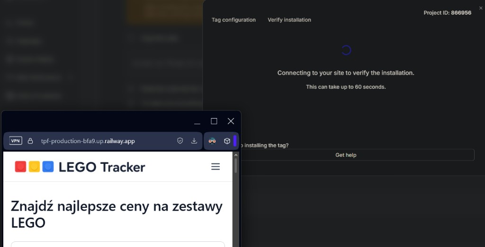
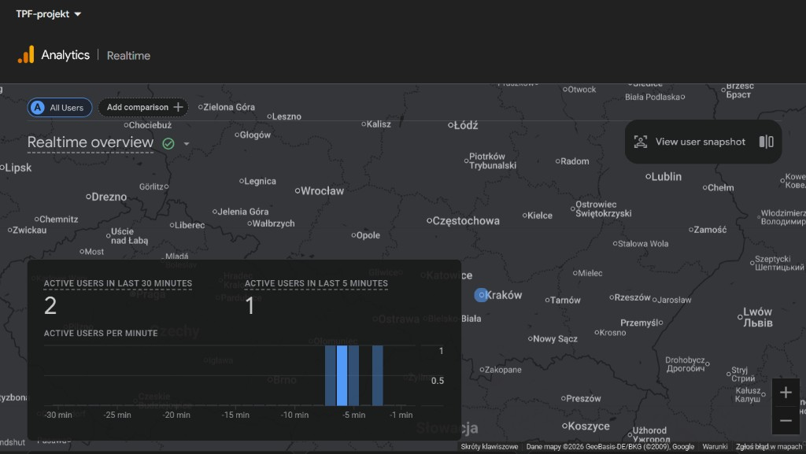
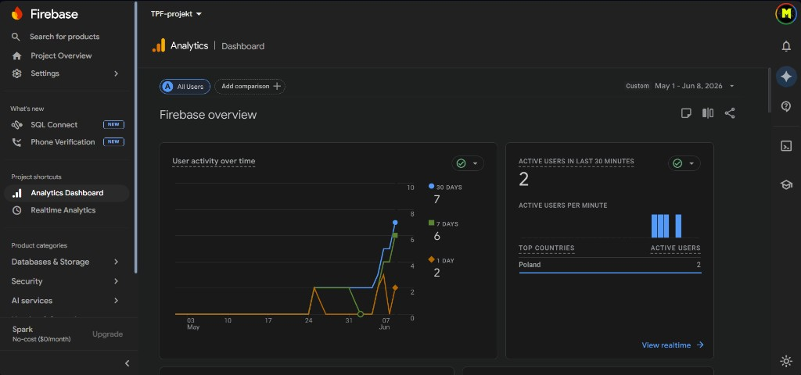
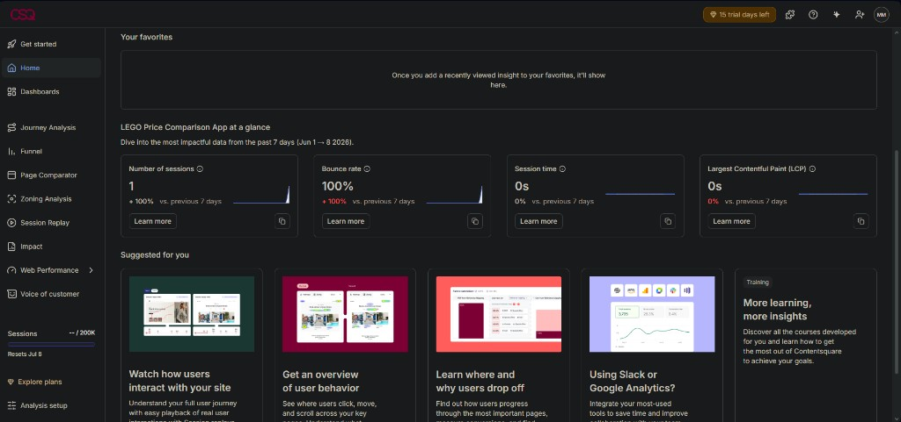

# LEGO Price Comparison App

Aplikacja do porównywania cen zestawów LEGO w polskich sklepach internetowych. Projekt zaliczeniowy z przedmiotu Techniki Projektowania Frontendowego.

**Live demo:** https://tpf-production-bfa9.up.railway.app

## Screeny aplikacji



## Uruchomienie lokalne

```bash
npm install
npm run dev
```

## Konfiguracja zmiennych środowiskowych

Utwórz plik `.env` na podstawie `.env.example`:

```
VITE_FIREBASE_API_KEY=
VITE_FIREBASE_AUTH_DOMAIN=
VITE_FIREBASE_PROJECT_ID=
VITE_FIREBASE_STORAGE_BUCKET=
VITE_FIREBASE_MESSAGING_SENDER_ID=
VITE_FIREBASE_APP_ID=
VITE_GA_MEASUREMENT_ID=
VITE_HOTJAR_SITE_ID=
```

## Firebase Authentication

1. Utwórz projekt w [Firebase Console](https://console.firebase.google.com)
2. Dodaj aplikację webową do projektu
3. Włącz metodę logowania Email/Password w Authentication → Sign-in method
4. Uzupełnij zmienne `VITE_FIREBASE_*` w `.env`

Zaimplementowane funkcje:
- Rejestracja (email + hasło + imię)
- Logowanie
- Wylogowanie
- Chronione trasy (`/wishlist`, `/profile`) — przekierowanie na `/login` dla niezalogowanych
- Trasy tylko dla gości (`/login`, `/register`) — przekierowanie na `/` dla zalogowanych

## Google Analytics

Integracja oparta na pakiecie `react-ga4`. Inicjalizacja w `Root.tsx`, śledzenie pageview przy każdej zmianie lokalizacji przez dedykowany komponent `AnalyticsListener`.

Dodaj swoje Measurement ID do `.env`:
```
VITE_GA_MEASUREMENT_ID=G-XXXXXXXXXX
```

### Screeny z Google Analytics

**Realtime — aktywni użytkownicy:**



**Firebase Analytics Dashboard:**



## Hotjar / Contentsquare

Integracja oparta na pakiecie `@hotjar/browser` oraz bezpośrednim tagu w `index.html`. Zbiera nagrania sesji, heatmapy i dane o zachowaniu użytkowników.

Dodaj Site ID do `.env`:
```
VITE_HOTJAR_SITE_ID=
```

### Screeny z Contentsquare

**Dashboard — dane sesji:**



## Deploy

Aplikacja deployowana na [Railway](https://railway.app) przy użyciu Dockerfile (multi-stage build: Node.js → nginx).

```dockerfile
# Build stage
FROM node:20-alpine AS builder
# ...
RUN npm run build

# Serve stage
FROM nginx:alpine
COPY --from=builder /app/dist /usr/share/nginx/html
```

Przy deployowaniu na Railway ustaw wszystkie zmienne środowiskowe w panelu **Variables** — są wymagane podczas build step (Vite bake'uje je do builda).
