# LEGO Price Comparison App

> Aplikacja webowa do porównywania cen zestawów LEGO w wielu sklepach, śledzenia historii cen oraz ustawiania alertów cenowych. Projekt zaliczeniowy z przedmiotu **Techniki projektowania frontendowego**.

- **Działające demo:** [https://tpf-production-bfa9.up.railway.app](https://tpf-production-bfa9.up.railway.app)
- **Prototyp (Figma):** [LEGO Price Comparison App](https://www.figma.com/design/IaDOCCrH0NYruNq2zYH3oY/LEGO-Price-Comparison-App)

---

## Spis treści

1. [Opis projektu](#1-opis-projektu)
2. [Demo](#2-demo)
3. [Screenshoty aplikacji](#3-screenshoty-aplikacji)
4. [Architektura i struktura projektu](#4-architektura-i-struktura-projektu)
5. [Technologie i zależności](#5-technologie-i-zależności)
6. [Instalacja i uruchomienie lokalne](#6-instalacja-i-uruchomienie-lokalne)
7. [Konfiguracja zmiennych środowiskowych](#7-konfiguracja-zmiennych-środowiskowych)
8. [Firebase Authentication](#8-firebase-authentication)
9. [Google Analytics 4](#9-google-analytics-4)
10. [Hotjar / Contentsquare](#10-hotjar--contentsquare)
11. [Deployment (Railway + Docker + Nginx)](#11-deployment-railway--docker--nginx)
12. [Mapowanie wymagań z checklisty](#12-mapowanie-wymagań-z-checklisty)
13. [Autorzy i informacje o projekcie](#13-autorzy-i-informacje-o-projekcie)

---

## 1. Opis projektu

**LEGO Price Comparison App** to aplikacja typu SPA (Single Page Application), która pomaga
fanom i kolekcjonerom LEGO znaleźć najlepszą cenę wybranego zestawu.

### Jaki problem rozwiązuje?

Zestawy LEGO bywają drogie, a ich ceny wahają się w czasie i różnią się między sklepami.
Ręczne sprawdzanie kilku sklepów internetowych (LEGO.com, Allegro, Empik, MediaMarkt, RTV Euro AGD)
jest żmudne. Aplikacja agreguje te informacje w jednym miejscu i pozwala:

- **porównać ceny** tego samego zestawu w różnych sklepach i od razu zobaczyć, gdzie jest najtaniej,
- **prześledzić historię cen** zestawu (wykres z ostatnich miesięcy), aby ocenić, czy obecna cena to dobra okazja,
- **dodać zestaw do listy obserwowanych** i ustawić **alert cenowy** - powiadomienie e-mail, gdy cena spadnie poniżej progu,
- **przeglądać i filtrować** katalog zestawów po serii, grupie wiekowej i przedziale cenowym,
- **zarządzać kontem** użytkownika (profil, powiadomienia, bezpieczeństwo, metody płatności).

### Dla kogo?

Dla osób kupujących zestawy LEGO (fani, kolekcjonerzy, rodzice), które chcą kupować świadomie
i w najlepszej cenie, a także otrzymywać powiadomienia o spadkach cen obserwowanych zestawów.

### Status danych

Aplikacja jest projektem frontendowym - dane o produktach, sklepach i historii cen są **danymi
przykładowymi (mock)** zaszytymi w kodzie (`src/app/data/`). Realna jest natomiast warstwa
uwierzytelniania (Firebase Authentication) oraz integracje analityczne (Google Analytics 4, Hotjar/Contentsquare).

---

## 2. Demo

Aplikacja jest wdrożona produkcyjnie na platformie **Railway**:

🔗 **[https://tpf-production-bfa9.up.railway.app](https://tpf-production-bfa9.up.railway.app)**

Konto można założyć samodzielnie w widoku **Zarejestruj się** (wymaga jedynie adresu e-mail i hasła
o długości min. 6 znaków). Po rejestracji/zalogowaniu odblokowują się trasy chronione
(*Lista życzeń*, *Profil*).

---

## 3. Screenshoty aplikacji

Aplikacja jest w pełni responsywna (RWD) - poniżej zebrano widoki w wersji desktop oraz mobilnej,
ilustrujące pełny flow użytkownika.

### 3.1. Widoki desktop

#### Strona główna (`/`)

Sekcja hero z wyszukiwarką, szybkie filtry po kategoriach (seriach) oraz sekcja „Gorące okazje”
z kartami produktów (komponent `ProductCard`).

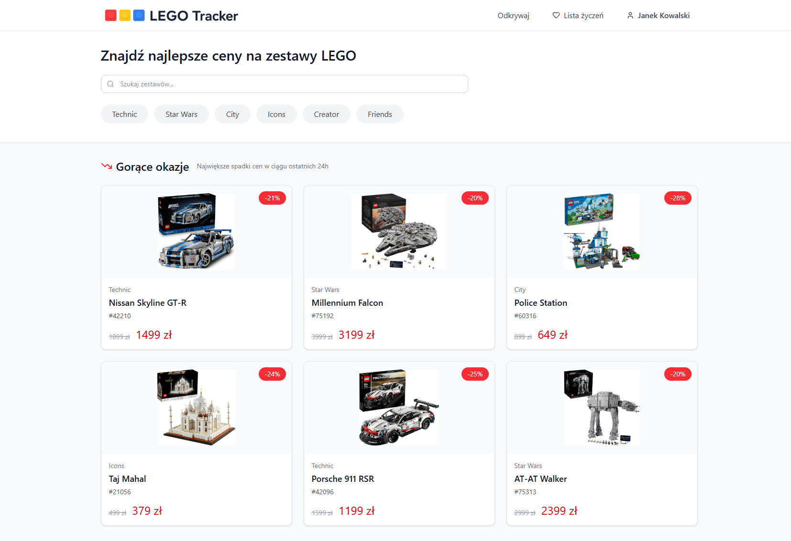

#### Wyniki wyszukiwania i filtry (`/search`)

Lista zestawów z bocznym panelem filtrów (seria, grupa wiekowa, przedział cenowy),
sortowaniem (popularność, cena rosnąco/malejąco, nazwa) oraz licznikiem wyników.

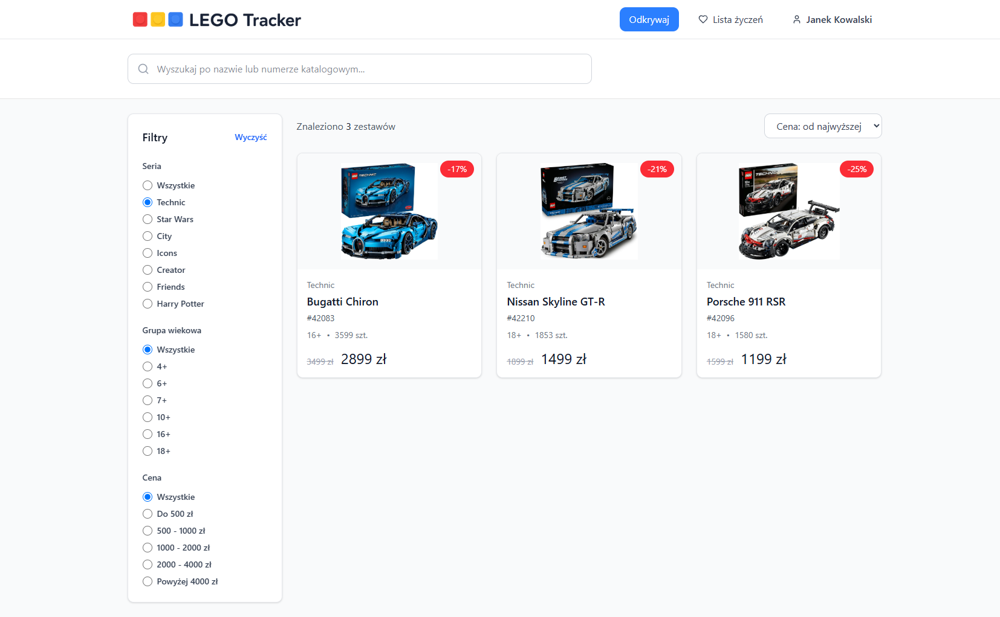

#### Szczegóły produktu (`/product/:id`)

Galeria zdjęć, aktualna najniższa cena i rabat, parametry zestawu, **wykres historii cen**
(Recharts) oraz lista **ofert sklepów** z oznaczeniem najlepszej ceny.

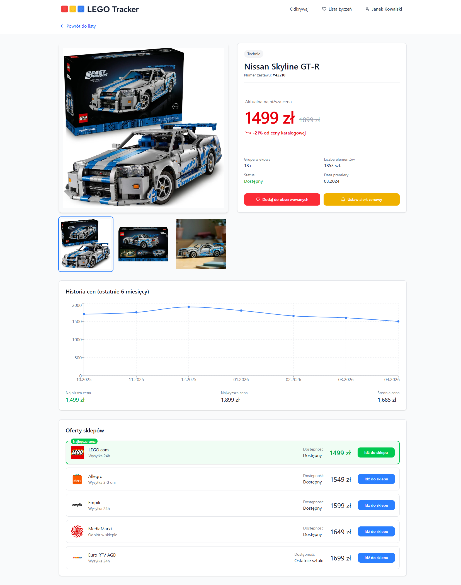

#### Modal alertu cenowego

Otwierany z poziomu szczegółów produktu - pozwala ustawić próg cenowy (z gotowymi presetami -5%, -10%, -15%, -20%
oraz „min. historyczna”), podgląd oszczędności i przełącznik powiadomień e-mail.

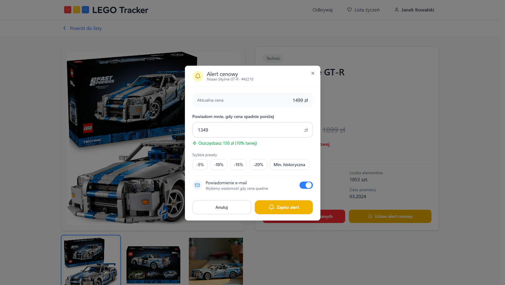

#### Lista życzeń / obserwowane (`/wishlist`) - *trasa chroniona*

Tabela obserwowanych zestawów z kafelkami podsumowania (liczba pozycji, aktywne alerty, autozakup),
progami alertów, zmianą ceny, przełącznikiem autozakupu oraz trybem edycji (zaznaczanie i usuwanie pozycji).

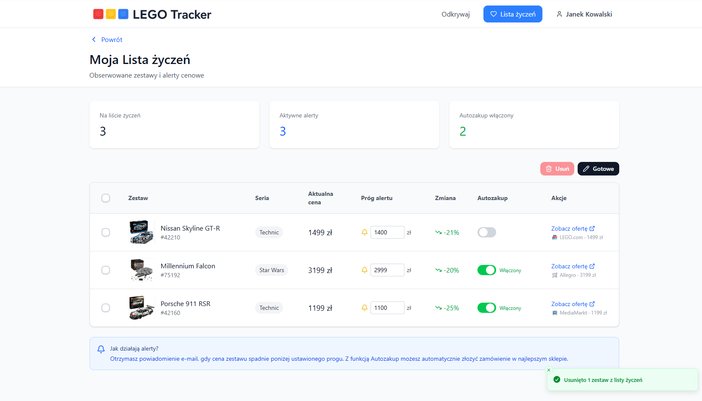

#### Profil - zakładka „Profil” (`/profile`) - *trasa chroniona*

Dane konta zalogowanego użytkownika pobierane z Firebase (e-mail, nazwa wyświetlana `displayName`
oraz data utworzenia konta), awatar z inicjałami i formularz danych osobowych. Imię i nazwisko
są wyprowadzane z `displayName` (podział po spacji) - Firebase nie przechowuje ich jako osobnych pól.
Telefon i adres to wartości przykładowe (placeholdery), niepochodzące z Firebase.

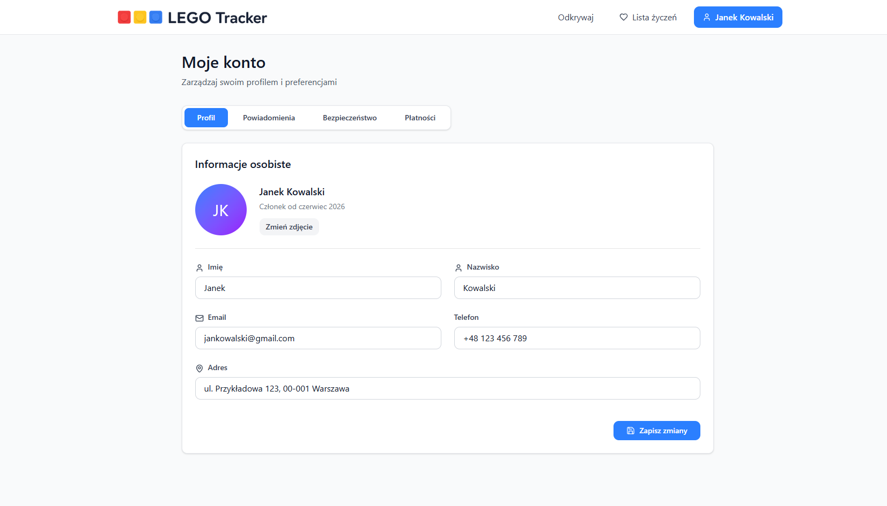

#### Profil - zakładka „Powiadomienia”

Preferencje powiadomień (e-mail, alerty cenowe, cotygodniowe podsumowanie, nowe premiery)
z przełącznikami `ToggleSwitch` i zależnościami między opcjami.

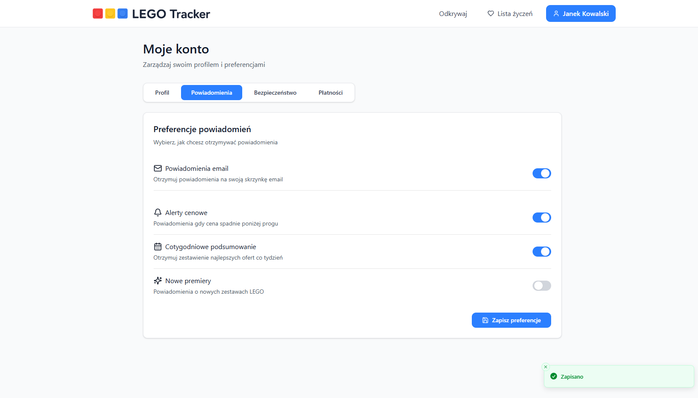

#### Profil - zakładka „Bezpieczeństwo”

Zmiana hasła oraz przełącznik uwierzytelniania dwuskładnikowego (2FA).

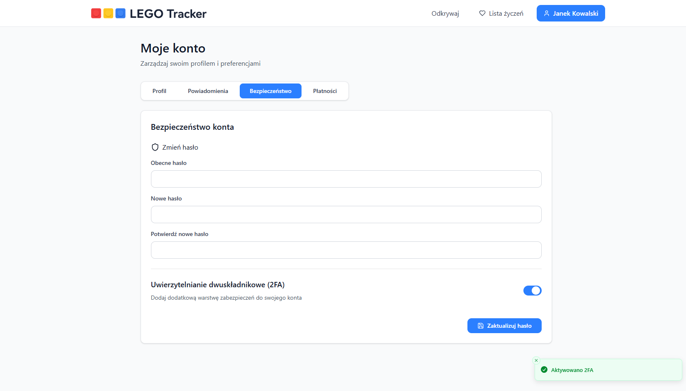

#### Profil - zakładka „Płatności”

Lista metod płatności (z oznaczeniem domyślnej), historia transakcji oraz dialog dodawania karty.

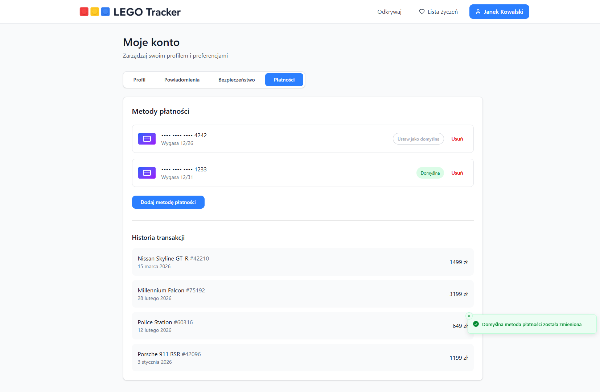

#### Dodawanie metody płatności (dialog)

Formularz dodania karty z walidacją numeru karty, daty ważności i CVV oraz informacją zwrotną (toasty `sonner`).

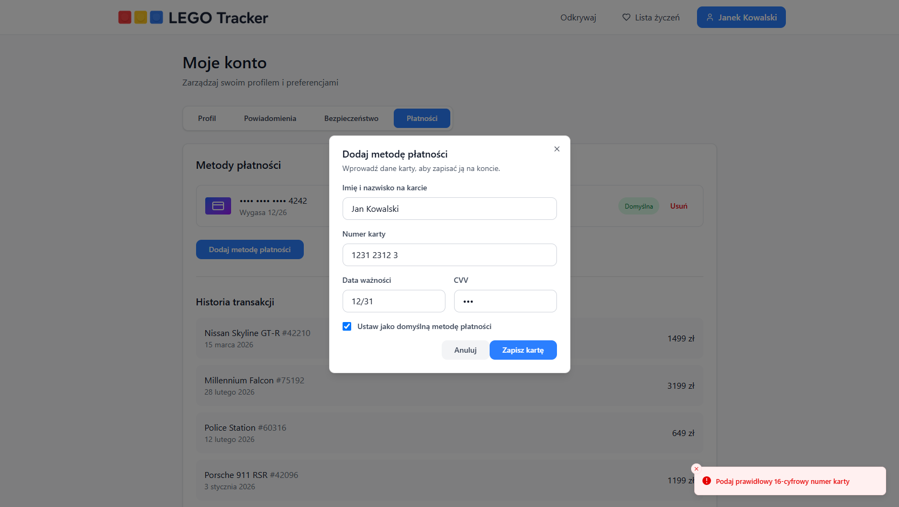

### 3.2. Widoki mobile (RWD)

#### Logowanie (`/login`)

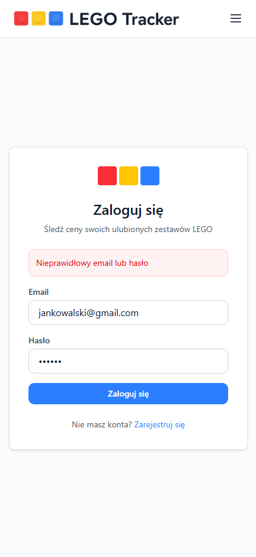

#### Rejestracja (`/register`)

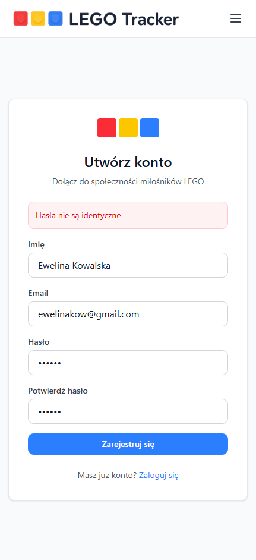

#### Wyszukiwarka (`/search`)

Na urządzeniach mobilnych panel filtrów zwija się do rozwijanego przycisku z licznikiem aktywnych filtrów.

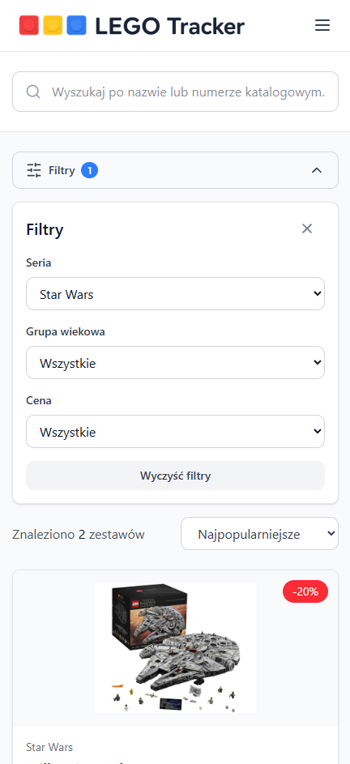

#### Szczegóły produktu (`/product/:id`)

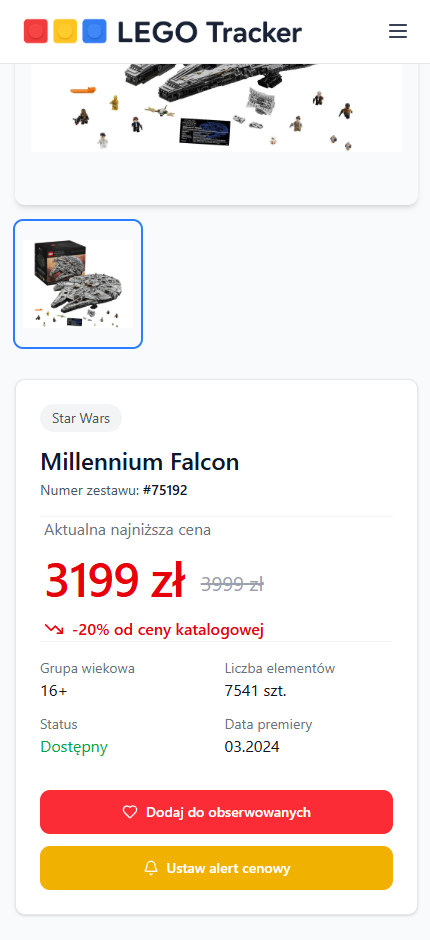

#### Lista życzeń (`/wishlist`)

W wersji mobilnej tabela zamienia się na czytelne karty.

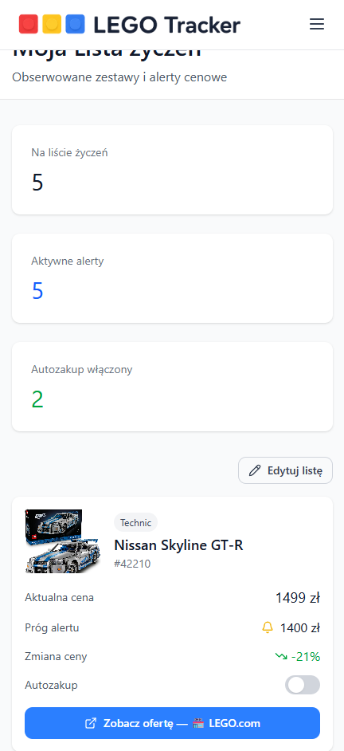

---

## 4. Architektura i struktura projektu

Aplikacja to klasyczne SPA zbudowane na **React 18 + Vite**, z routingiem **React Router 7**,
warstwą uwierzytelniania **Firebase Auth** oraz integracjami analitycznymi (GA4, Hotjar/Contentsquare).

### 4.1. Punkt wejścia i bootstrap

Inicjalizacja aplikacji odbywa się w `src/main.tsx`. To tutaj - na poziomie głównego punktu wejścia -
inicjalizowany jest **Hotjar**, zgodnie z wymaganiem checklisty:

```7:9:src/main.tsx
initHotjar(import.meta.env.VITE_HOTJAR_SITE_ID);

createRoot(document.getElementById("root")!).render(<App />);
```

`src/app/App.tsx` montuje router (`RouterProvider`), a `src/app/Root.tsx` pełni rolę **wspólnego layoutu**
dla wszystkich tras: opakowuje aplikację w `AuthProvider`, montuje `Header`, `AnalyticsListener`,
globalne powiadomienia `Toaster` (sonner) oraz inicjalizuje Google Analytics.

### 4.2. Struktura folderów

```
TPF/
├── docs/                         # Zrzuty ekranu do dokumentacji (README)
│   ├── desktop/                  # Widoki desktop
│   ├── mobile/                   # Widoki mobilne (RWD)
│   ├── analytics/                # Dowody działania Google Analytics 4
│   ├── hotjar/                   # Dowody działania Hotjar / Contentsquare
│   ├── firebase-authentication.png
│   └── railway.png
├── src/
│   ├── main.tsx                  # Punkt wejścia, inicjalizacja Hotjar, render <App/>
│   ├── app/
│   │   ├── App.tsx               # RouterProvider
│   │   ├── Root.tsx              # Wspólny layout: AuthProvider, Header, AnalyticsListener, Toaster, init GA
│   │   ├── routes.tsx            # Definicja tras (createBrowserRouter)
│   │   ├── pages/                # Komponenty stron (1 plik = 1 widok/trasa)
│   │   │   ├── HomePage.tsx
│   │   │   ├── SearchResults.tsx
│   │   │   ├── ProductDetail.tsx
│   │   │   ├── Watchlist.tsx
│   │   │   ├── Profile.tsx
│   │   │   ├── Login.tsx
│   │   │   ├── Register.tsx
│   │   │   └── NotFound.tsx       # Fallback 404
│   │   ├── components/           # Reużywalne komponenty UI
│   │   │   ├── Header.tsx
│   │   │   ├── ProductCard.tsx
│   │   │   ├── SearchBar.tsx
│   │   │   ├── Button.tsx
│   │   │   ├── Modal.tsx
│   │   │   ├── FormField.tsx
│   │   │   ├── ToggleSwitch.tsx
│   │   │   ├── Tabs.tsx
│   │   │   ├── StatCard.tsx
│   │   │   ├── ContentCard.tsx
│   │   │   ├── PageLayout.tsx / PageHeader.tsx
│   │   │   ├── AuthLayout.tsx
│   │   │   ├── ProtectedRoute.tsx  # ProtectedRoute + GuestRoute
│   │   │   ├── AnalyticsListener.tsx
│   │   │   ├── ErrorAlert.tsx / BackLink.tsx / LegoLogo.tsx ...
│   │   │   └── ui/                 # Prymitywy shadcn/ui (Radix) - biblioteka komponentów bazowych
│   │   ├── contexts/
│   │   │   └── AuthContext.tsx    # Globalny stan uwierzytelnienia (Firebase Auth)
│   │   ├── lib/
│   │   │   ├── firebase.ts        # Inicjalizacja Firebase + getAuth()
│   │   │   ├── analytics.ts       # Inicjalizacja Google Analytics 4 (react-ga4)
│   │   │   └── hotjar.ts          # Inicjalizacja Hotjar / Contentsquare
│   │   ├── data/                  # Dane przykładowe (mock) + helpery do obrazków
│   │   │   ├── mockProducts.ts
│   │   │   ├── categories.ts
│   │   │   ├── getMockImage.ts
│   │   │   └── getShopLogo.ts
│   │   └── styles/tokens.ts       # Współdzielone klasy/tokeny stylów (Tailwind)
│   ├── assets/images/             # Logo, zdjęcia zestawów (mocks/), loga sklepów (shops/)
│   └── styles/                    # Globalne style, Tailwind, motyw, fonty
├── Dockerfile                     # Multi-stage build (Node → Nginx) dla Railway
├── nginx.conf                     # Konfiguracja serwera (SPA fallback, gzip)
├── vite.config.ts
├── tsconfig.json
├── package.json
└── .env.example                  # Szablon zmiennych środowiskowych
```

### 4.3. Routing (React Router 7)

Trasy zdefiniowane są deklaratywnie w `src/app/routes.tsx` przez `createBrowserRouter`.
Wszystkie widoki współdzielą wspólny layout `Root` (zagnieżdżony routing),
a nieistniejące ścieżki obsługuje fallback **404**.


| Trasa          | Komponent strony | Dostęp        | Opis                                                    |
| -------------- | ---------------- | ------------- | ------------------------------------------------------- |
| `/`            | `HomePage`       | publiczna     | Strona główna: hero, wyszukiwarka, „Gorące okazje”      |
| `/search`      | `SearchResults`  | publiczna     | Wyniki wyszukiwania + filtry i sortowanie               |
| `/product/:id` | `ProductDetail`  | publiczna     | Szczegóły zestawu, historia cen, oferty sklepów         |
| `/wishlist`    | `Watchlist`      | **chroniona** | Lista obserwowanych zestawów i alerty                   |
| `/profile`     | `Profile`        | **chroniona** | Konto: profil, powiadomienia, bezpieczeństwo, płatności |
| `/login`       | `Login`          | tylko gość    | Logowanie (Firebase Auth)                               |
| `/register`    | `Register`       | tylko gość    | Rejestracja (Firebase Auth)                             |
| `*`            | `NotFound`       | publiczna     | **Fallback 404**                                        |


Logika dostępu jest realizowana przez dwa komponenty-strażniki w `ProtectedRoute.tsx`:

- `**ProtectedRoute`** - chroni `/wishlist` i `/profile`. Niezalogowanego użytkownika przekierowuje na `/login`
(zapamiętując trasę docelową w `state.from`, aby po zalogowaniu wrócić we właściwe miejsce).
- `**GuestRoute**` - chroni `/login` i `/register`. Zalogowanego użytkownika przekierowuje na `/`
(nie ma sensu pokazywać formularzy logowania osobie już zalogowanej).

Nawigacja między ekranami odbywa się **bez przeładowania strony** (komponenty `Link` / `useNavigate`).

### 4.4. Flow użytkownika

1. Użytkownik wchodzi na **stronę główną**, korzysta z wyszukiwarki lub szybkich kategorii.
2. Trafia na **wyniki wyszukiwania**, gdzie filtruje i sortuje zestawy.
3. Wybiera zestaw i przechodzi do **szczegółów produktu** - porównuje oferty sklepów i analizuje historię cen.
4. Aby ustawić **alert cenowy** lub dodać zestaw do **listy życzeń**, musi być zalogowany - próba wejścia
  na trasę chronioną przekierowuje na **logowanie** (i z powrotem po sukcesie).
5. Po zalogowaniu zarządza **listą obserwowanych** i **kontem** (profil, powiadomienia, bezpieczeństwo, płatności).

### 4.5. Podział na `pages` i `components`

Zgodnie z wymaganiami:

- `**pages/`** zawiera pełne ekrany powiązane z routingiem (1 plik = 1 widok).
- `**components/**` zawiera reużywalne elementy UI przyjmujące `props`, używane wielokrotnie w różnych
widokach, np.:
  - `ProductCard` - karta zestawu (warianty `compact` / `full`) - używana na stronie głównej i w wynikach wyszukiwania,
  - `Button` - uniwersalny przycisk z wieloma wariantami (`primary`, `danger`, `warning`, `outline`, `pill`, `chip`…),
  - `SearchBar`, `FormField`, `Modal`, `ToggleSwitch`, `Tabs`, `StatCard`, `ContentCard`, `PageLayout`, `Header` itd.
- `**components/ui/**` to zestaw prymitywów **shadcn/ui** opartych na Radix UI (dialog, select, checkbox, tabs…),
stanowiących bazę dla komponentów wyższego poziomu.

---

## 5. Technologie i zależności

Pełny stos technologiczny odczytany z `package.json`.

### Rdzeń


| Technologia      | Wersja | Rola                                |
| ---------------- | ------ | ----------------------------------- |
| **React**        | 18.3.1 | Biblioteka UI                       |
| **React DOM**    | 18.3.1 | Renderowanie do DOM                 |
| **TypeScript**   | ^6.0.3 | Typowanie statyczne                 |
| **Vite**         | 6.3.5  | Bundler / dev server                |
| **React Router** | 7.13.0 | Routing SPA (`createBrowserRouter`) |


### Stylowanie i UI


| Technologia                                                | Wersja   | Rola                                                       |
| ---------------------------------------------------------- | -------- | ---------------------------------------------------------- |
| **Tailwind CSS**                                           | 4.1.12   | Stylowanie utility-first (spójna, jedna metoda stylowania) |
| **@tailwindcss/vite**                                      | 4.1.12   | Integracja Tailwind z Vite                                 |
| **Radix UI** (`@radix-ui/`*)                               | -        | Dostępne prymitywy UI (baza shadcn/ui)                     |
| **MUI** (`@mui/material`, `@mui/icons-material`)           | 7.3.5    | Komponenty/ikony Material UI                               |
| **lucide-react**                                           | 0.487.0  | Zestaw ikon                                                |
| **class-variance-authority**, **clsx**, **tailwind-merge** | -        | Komponowanie klas CSS / warianty                           |
| **motion**                                                 | 12.23.24 | Animacje                                                   |
| **sonner**                                                 | 2.0.3    | Powiadomienia toast                                        |
| **canvas-confetti**                                        | 1.9.4    | Efekty wizualne                                            |


### Dane, formularze, wizualizacje


| Technologia                               | Wersja | Rola                |
| ----------------------------------------- | ------ | ------------------- |
| **recharts**                              | 2.15.2 | Wykres historii cen |
| **react-hook-form**                       | 7.55.0 | Obsługa formularzy  |
| **date-fns**                              | 3.6.0  | Operacje na datach  |
| **embla-carousel-react**, **react-slick** | -      | Karuzele            |


### Backend-as-a-Service i analityka


| Technologia         | Wersja   | Rola                                                |
| ------------------- | -------- | --------------------------------------------------- |
| **firebase**        | ^12.13.0 | Firebase Authentication (Email/Password)            |
| **react-ga4**       | ^3.0.1   | Integracja z Google Analytics 4                     |
| **@hotjar/browser** | ^1.0.9   | Integracja z Hotjar (analiza zachowań użytkowników) |


### Build / deployment


| Technologia                                    | Rola                                           |
| ---------------------------------------------- | ---------------------------------------------- |
| **Docker** (`node:20-alpine` → `nginx:alpine`) | Wieloetapowy build i serwowanie statyków       |
| **Nginx**                                      | Serwer HTTP z fallbackiem SPA i kompresją gzip |
| **Railway**                                    | Platforma hostingowa (deployment produkcyjny)  |


---

## 6. Instalacja i uruchomienie lokalne

### Wymagania wstępne

- **Node.js** w wersji **20+** (zgodnie z obrazem `node:20-alpine` użytym w produkcji)
- Menedżer pakietów **npm**

### Kroki

```bash
# 1. Sklonuj repozytorium i wejdź do katalogu projektu
git clone <adres-repozytorium>
cd TPF

# 2. Zainstaluj zależności
npm install

# 3. Utwórz plik .env na podstawie szablonu i uzupełnij wartości
#    (Windows PowerShell)
Copy-Item .env.example .env
#    (Linux / macOS)
cp .env.example .env

# 4. Uruchom serwer deweloperski
npm run dev
```

Po uruchomieniu Vite wyświetli lokalny adres (domyślnie `http://localhost:5173`).

### Dostępne skrypty (`package.json`)


| Skrypt          | Komenda      | Opis                                  |
| --------------- | ------------ | ------------------------------------- |
| `npm run dev`   | `vite`       | Serwer deweloperski z hot-reload      |
| `npm run build` | `vite build` | Produkcyjny build do katalogu `dist/` |


> **Uwaga:** Bez uzupełnionych zmiennych Firebase aplikacja uruchomi się, ale logowanie/rejestracja
> będą nieaktywne (klient Firebase nie zostanie zainicjalizowany - patrz `src/app/lib/firebase.ts`).
> Analogicznie, bez `VITE_GA_MEASUREMENT_ID` i `VITE_HOTJAR_SITE_ID` integracje analityczne pozostaną wyłączone.

---

## 7. Konfiguracja zmiennych środowiskowych

Wszystkie zmienne konfiguracyjne są zmiennymi środowiskowymi Vite (prefiks `VITE_`) i są wczytywane
przez `import.meta.env`. Zdefiniuj je w pliku `.env` w katalogu głównym projektu.

### Plik `.env.example`

```env
# Firebase Web App configuration
VITE_FIREBASE_API_KEY=
VITE_FIREBASE_AUTH_DOMAIN=
VITE_FIREBASE_PROJECT_ID=
VITE_FIREBASE_STORAGE_BUCKET=
VITE_FIREBASE_MESSAGING_SENDER_ID=
VITE_FIREBASE_APP_ID=

# Google Analytics 4 (Measurement ID)
VITE_GA_MEASUREMENT_ID=

# Hotjar / Contentsquare (Site ID)
VITE_HOTJAR_SITE_ID=
```

### Opis zmiennych


| Zmienna                             | Wymagana            | Opis                                 | Przykład                           |
| ----------------------------------- | ------------------- | ------------------------------------ | ---------------------------------- |
| `VITE_FIREBASE_API_KEY`             | tak (dla logowania) | Klucz API aplikacji webowej Firebase | `AIzaSy...`                        |
| `VITE_FIREBASE_AUTH_DOMAIN`         | tak                 | Domena uwierzytelniania              | `twoj-projekt.firebaseapp.com`     |
| `VITE_FIREBASE_PROJECT_ID`          | tak                 | Identyfikator projektu Firebase      | `twoj-projekt`                     |
| `VITE_FIREBASE_STORAGE_BUCKET`      | tak                 | Bucket Storage                       | `twoj-projekt.firebasestorage.app` |
| `VITE_FIREBASE_MESSAGING_SENDER_ID` | tak                 | ID nadawcy (Cloud Messaging)         | `123456789012`                     |
| `VITE_FIREBASE_APP_ID`              | tak                 | Identyfikator aplikacji webowej      | `1:123...:web:abc...`              |
| `VITE_GA_MEASUREMENT_ID`            | opcjonalna          | Measurement ID Google Analytics 4    | `G-XXXXXXXXXX`                     |
| `VITE_HOTJAR_SITE_ID`               | opcjonalna          | Site ID Hotjar / Contentsquare       | `1234567`                          |


> Wartości Firebase pochodzą z konfiguracji aplikacji webowej w **Firebase Console → Project settings → General**.

### Zmienne środowiskowe na produkcji (Railway)

Na produkcji te same zmienne są przekazywane jako **build-time arguments** do Dockera (sekcja `ARG`/`ENV`
w `Dockerfile`), ponieważ Vite statycznie podmienia odwołania `import.meta.env.VITE_*` na dosłowne
wartości w trakcie budowania. Komplet zmiennych ustawia się w panelu Railway (Variables):

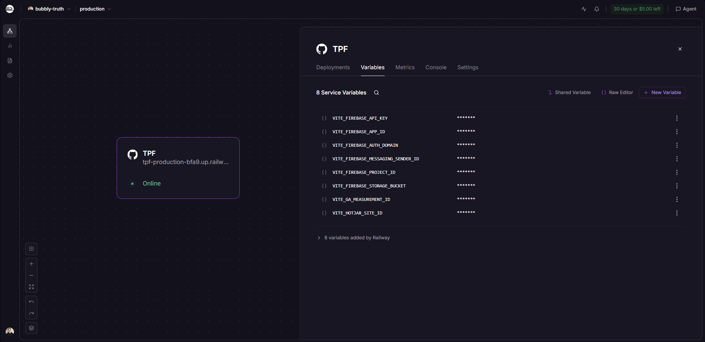

---

## 8. Firebase Authentication

Logowanie i rejestracja użytkowników są w pełni zrealizowane przy użyciu **Firebase Authentication**
(metoda **Email/Password**).

### Konfiguracja po stronie Firebase

1. Utworzono projekt w **Firebase Console**.
2. Dodano aplikację webową i pobrano konfigurację (`firebaseConfig`).
3. Zainstalowano pakiet `firebase`.
4. Skonfigurowano `initializeApp(firebaseConfig)` oraz `getAuth()`.
5. Włączono metodę **Email/Password** w sekcji *Authentication → Sign-in method*.

### Implementacja w kodzie

**Inicjalizacja klienta** - `src/app/lib/firebase.ts`. Konfiguracja jest budowana ze zmiennych `.env`.
Aplikacja inicjalizuje Firebase tylko gdy wszystkie pola konfiguracji są wypełnione (`hasFirebaseConfig`),
co pozwala bezpiecznie uruchomić projekt także bez kompletnego `.env`:

```13:21:src/app/lib/firebase.ts
const hasFirebaseConfig = Object.values(firebaseConfig).every(Boolean);

export const firebaseApp = hasFirebaseConfig
  ? getApps().length > 0
    ? getApps()[0]
    : initializeApp(firebaseConfig)
  : null;

export const firebaseAuth = firebaseApp ? getAuth(firebaseApp) : null;
```

**Globalny stan uwierzytelnienia** - `src/app/contexts/AuthContext.tsx`. Kontekst `AuthProvider`
opakowuje całą aplikację (w `Root.tsx`) i udostępnia hook `useAuth()` z:

- `user`, `isAuthenticated`, `loading`,
- `login(email, password)` → `signInWithEmailAndPassword`,
- `register(email, password, name)` → `createUserWithEmailAndPassword` + `updateProfile` (zapis nazwy),
- `logout()` → `signOut`.

Stan sesji jest synchronizowany na bieżąco przez `onAuthStateChanged` (utrzymanie zalogowania po odświeżeniu strony).

**Formularze** - `src/app/pages/Login.tsx` oraz `src/app/pages/Register.tsx` (z walidacją:
wymagane pola, zgodność haseł, minimalna długość hasła, czytelne komunikaty błędów przez `ErrorAlert`).

**Wylogowanie** - dostępne z menu użytkownika w `Header.tsx`.

**Ochrona tras** - `src/app/components/ProtectedRoute.tsx` (komponenty `ProtectedRoute` i `GuestRoute`,
opisane w sekcji [4.3](#43-routing-react-router-7)). Trasy `/wishlist` i `/profile` wymagają zalogowania.

### Dowód działania

Poniżej zarejestrowani użytkownicy widoczni w panelu **Firebase Authentication**:

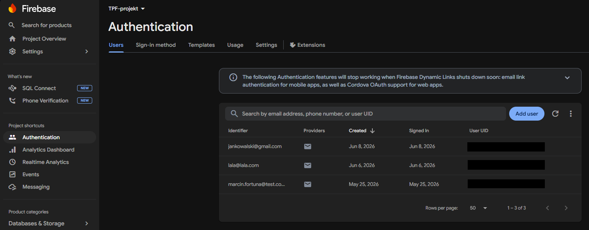

---

## 9. Google Analytics 4

Integracja z **Google Analytics 4** zrealizowana zgodnie z dobrymi praktykami dla aplikacji SPA
(śledzenie odsłon przy każdej zmianie trasy, ponieważ przejścia nie przeładowują strony).

### Implementacja

**Inicjalizacja** - `src/app/lib/analytics.ts`. Funkcja `initGoogleAnalytics` inicjalizuje `react-ga4`
tylko raz i tylko gdy `VITE_GA_MEASUREMENT_ID` jest ustawione:

```5:12:src/app/lib/analytics.ts
export function initGoogleAnalytics(measurementId: string | undefined) {
  if (!measurementId || initialized) {
    return;
  }

  initialized = true;
  ReactGA.initialize(measurementId);
}
```

Inicjalizacja jest wywoływana w głównym layoucie `Root.tsx` (w `useEffect`), z `measurementId` pobranym z `.env`.

**Śledzenie odsłon (page views)** - `src/app/components/AnalyticsListener.tsx`. Komponent nasłuchuje
zmian trasy przez `useLocation` i przy każdej zmianie wysyła zdarzenie `pageview`:

```5:16:src/app/components/AnalyticsListener.tsx
export function AnalyticsListener() {
  const location = useLocation();

  useEffect(() => {
    ReactGA.send({
      hitType: 'pageview',
      page: location.pathname + location.search,
    });
  }, [location]);

  return null;
}
```

`AnalyticsListener` jest zamontowany w `Root.tsx`, wewnątrz kontekstu routera, dzięki czemu działa dla każdej trasy.

### Dowody działania

**Raport „W czasie rzeczywistym” (Realtime)** - aktywni użytkownicy w trakcie korzystania z aplikacji:

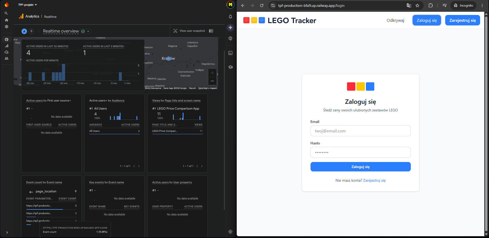

**Pulpit / raporty GA4** - zebrane dane o ruchu w aplikacji:

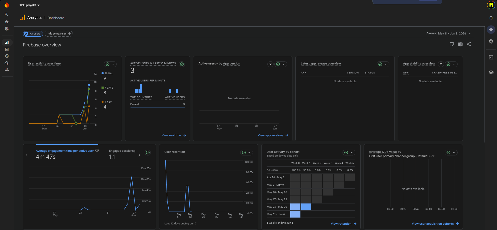

**Zdarzenia `page_view`** - potwierdzenie poprawnego śledzenia odsłon przy zmianach tras SPA:

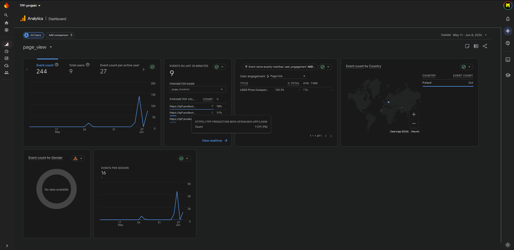

---

## 10. Hotjar / Contentsquare

Zgodnie z wymaganiem checklisty zintegrowano narzędzie do **analizy zachowań użytkowników**.
**Hotjar** jest obecnie częścią ekosystemu **Contentsquare**, dlatego skrypt śledzący ładowany jest
z domeny Contentsquare - funkcjonalnie jest to ta sama integracja.

### Implementacja

Inicjalizacja odbywa się **na poziomie głównego punktu wejścia aplikacji** (`src/main.tsx`), tuż przed
renderem `<App/>`:

```1:9:src/main.tsx
import { createRoot } from "react-dom/client";
import App from "./app/App.tsx";
import { initHotjar } from "./app/lib/hotjar";
import "./styles/index.css";

initHotjar(import.meta.env.VITE_HOTJAR_SITE_ID);

createRoot(document.getElementById("root")!).render(<App />);
```

Logika w `src/app/lib/hotjar.ts` jest elastyczna i obsługuje obie konwencje identyfikatora:

- jeśli `VITE_HOTJAR_SITE_ID` jest **liczbą** - używa oficjalnego SDK `@hotjar/browser` (`Hotjar.init(siteId, 6)`),
- w przeciwnym razie wstrzykuje **tag Contentsquare** (`https://t.contentsquare.net/uxa/<siteId>.js`),
zabezpieczając się przed wielokrotnym załadowaniem skryptu.

```11:32:src/app/lib/hotjar.ts
export function initHotjar(siteId: string | undefined) {
  if (!siteId || hotjarInitialized) {
    return;
  }

  hotjarInitialized = true;

  const numericId = Number(siteId);
  if (numericId) {
    Hotjar.init(numericId, 6);
    return;
  }

  if (contentsquareScriptLoaded(siteId)) {
    return;
  }

  const script = document.createElement('script');
  script.async = true;
  script.src = `https://t.contentsquare.net/uxa/${siteId}.js`;
  document.head.appendChild(script);
}
```

### Dowody działania

**Tag zweryfikowany / poprawnie zainstalowany:**

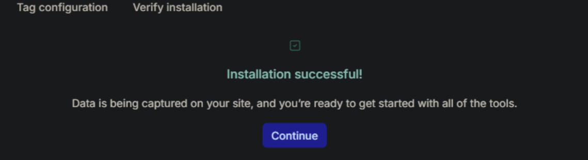

**Pulpit Contentsquare/Hotjar:**

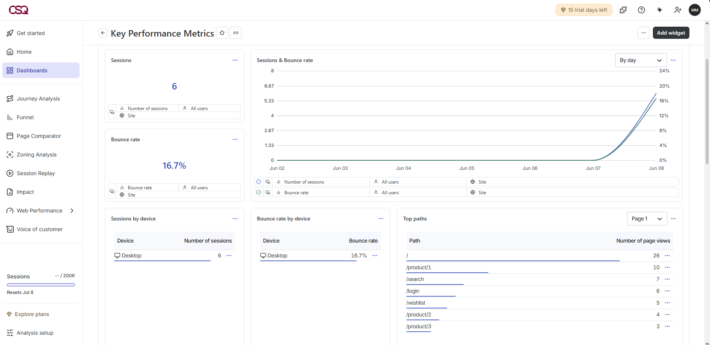

**Widok narzędzia:**

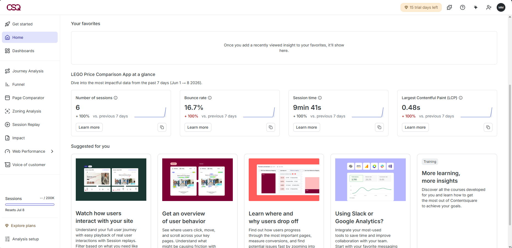

**Nagrania sesji (Session Replay):**

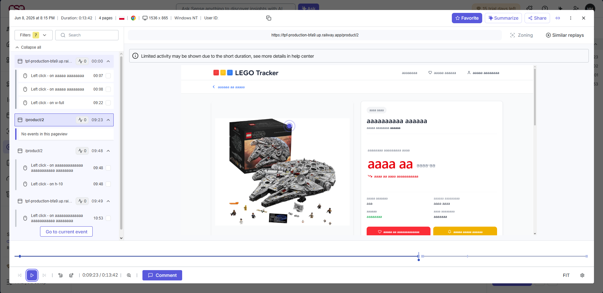

---

## 11. Deployment (Railway + Docker + Nginx)

Aplikacja jest wdrożona na platformie **Railway** z wykorzystaniem **wieloetapowego obrazu Docker**.

🔗 **Produkcja:** [https://tpf-production-bfa9.up.railway.app](https://tpf-production-bfa9.up.railway.app)

### Jak to działa

1. **Etap budowania (`node:20-alpine`)** - instalacja zależności (`npm ci`) i produkcyjny build Vite
  (`npm run build`) do katalogu `dist/`. Zmienne `VITE_`* są przekazywane jako `ARG`/`ENV`, ponieważ Vite
   wstawia ich wartości na stałe do bundla na etapie budowania (a nie odczytuje ich w czasie działania).
2. **Etap serwowania (`nginx:alpine`)** - statyczne pliki z `dist/` są kopiowane do `usr/share/nginx/html`
  i serwowane przez Nginx z własną konfiguracją.

`Dockerfile` (multi-stage):

```29:36:Dockerfile
FROM nginx:alpine

COPY --from=builder /app/dist /usr/share/nginx/html
COPY nginx.conf /etc/nginx/conf.d/default.conf

EXPOSE 80

CMD ["nginx", "-g", "daemon off;"]
```

Konfiguracja Nginx (`nginx.conf`) realizuje dwie rzeczy. Po pierwsze - **fallback wszystkich ścieżek do `index.html`**,
co jest warunkiem koniecznym działania routingu SPA po stronie klienta: bez tego bezpośrednie wejście lub odświeżenie
na trasie takiej jak `/profile` zwróciłoby `404` (Nginx nie ma tam fizycznego pliku). Po drugie - **kompresję gzip**,
która nie jest wymagana do działania aplikacji, a stanowi optymalizację wydajności (mniejszy rozmiar przesyłanych zasobów):

```7:13:nginx.conf
    location / {
        try_files $uri $uri/ /index.html;
    }

    gzip on;
    gzip_types text/plain text/css application/javascript application/json image/svg+xml;
    gzip_min_length 1024;
```

### Proces wdrożenia na Railway

1. Repozytorium podłączone do Railway - wdrożenie na podstawie `Dockerfile`.
2. W panelu **Variables** ustawiono wszystkie zmienne `VITE_`* (Firebase, GA4, Hotjar) - patrz sekcja [7](#7-konfiguracja-zmiennych-środowiskowych).
3. Każdy push do gałęzi głównej uruchamia automatyczny build obrazu i ponowne wdrożenie.
4. Railway udostępnia publiczny URL produkcyjny.

---

## 12. Mapowanie wymagań z checklisty

Tabela ułatwiająca ocenę - każdy punkt checklisty wraz z miejscem realizacji w projekcie.


| Wymaganie (checklista)                          | Status | Gdzie / dowód                                                                                                                                                     |
| ----------------------------------------------- | ------ | ----------------------------------------------------------------------------------------------------------------------------------------------------------------- |
| Wierne odwzorowanie prototypu (Figma)           | ✅      | Wszystkie ekrany z [Figmy](https://www.figma.com/design/IaDOCCrH0NYruNq2zYH3oY/LEGO-Price-Comparison-App) zaimplementowane - sekcja [3](#3-screenshoty-aplikacji) |
| Każdy ekran dostępny przez React Router         | ✅      | `src/app/routes.tsx`, tabela tras w [4.3](#43-routing-react-router-7)                                                                                             |
| Fallback 404 dla nieistniejących ścieżek        | ✅      | Trasa `*` → `NotFound` (`src/app/pages/NotFound.tsx`)                                                                                                             |
| Nawigacja bez przeładowania strony              | ✅      | `Link` / `useNavigate` (React Router)                                                                                                                             |
| Trasy chronione po zalogowaniu                  | ✅      | `ProtectedRoute` / `GuestRoute` (`src/app/components/ProtectedRoute.tsx`)                                                                                         |
| Zagnieżdżony routing + wspólny layout           | ✅      | `Root.tsx` jako layout nadrzędny dla wszystkich tras                                                                                                              |
| Podział na komponenty stron w `pages/`          | ✅      | `src/app/pages/` (8 widoków)                                                                                                                                      |
| Reużywalne komponenty z `props` w `components/` | ✅      | `src/app/components/` (m.in. `ProductCard`, `Button`, `Modal`, `FormField`)                                                                                       |
| Ostylowanie i czytelność (jedna spójna metoda)  | ✅      | Tailwind CSS 4 + tokeny w `src/app/styles/tokens.ts`                                                                                                              |
| Logowanie przez Firebase Authentication         | ✅      | `lib/firebase.ts`, `contexts/AuthContext.tsx`, sekcja [8](#8-firebase-authentication)                                                                             |
| Integracja Hotjar (w głównym komponencie)       | ✅      | `main.tsx` + `lib/hotjar.ts`, sekcja [10](#10-hotjar--contentsquare)                                                                                              |
| Integracja Google Analytics                     | ✅      | `lib/analytics.ts` + `AnalyticsListener.tsx`, sekcja [9](#9-google-analytics-4)                                                                                   |
| Deploy aplikacji                                | ✅      | Railway + Docker + Nginx, sekcja [11](#11-deployment-railway--docker--nginx)                                                                                      |
| README ze screenami aplikacji, GA i Hotjar      | ✅      | Ten dokument (sekcje [3](#3-screenshoty-aplikacji), [9](#9-google-analytics-4), [10](#10-hotjar--contentsquare))                                                  |


---

## 13. Autorzy i informacje o projekcie

- **Przedmiot:** Techniki projektowania frontendowego
- **Projekt:** LEGO Price Comparison App
- **Zespół:** Marcin Fortuna, Miłosz Pabis, Mikołaj Munik
- **Prototyp (Figma):** [LEGO Price Comparison App](https://www.figma.com/design/IaDOCCrH0NYruNq2zYH3oY/LEGO-Price-Comparison-App)
- **Demo produkcyjne:** [https://tpf-production-bfa9.up.railway.app](https://tpf-production-bfa9.up.railway.app)

> Projekt przygotowany w celach edukacyjnych. Dane o produktach, cenach i sklepach są danymi przykładowymi
> (mock) i nie odzwierciedlają rzeczywistych ofert handlowych. LEGO® jest znakiem towarowym Grupy LEGO,
> która nie sponsoruje ani nie autoryzuje tego projektu.